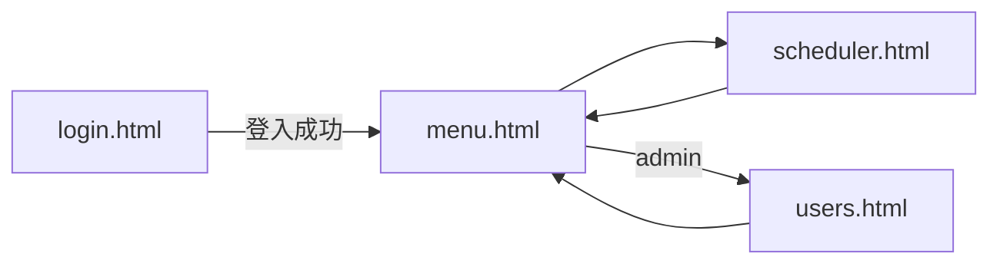

# Bat Scheduler 系統設計文件

版本：1.0  
更新日期：2026-07-24  
Repository：https://github.com/fstan1201/BatScheduler

---

## 1. 文件目的

說明 Bat Scheduler 的系統目標、架構、模組分工、資料與 API、安全模型及部署方式，供開發、維運與後續擴充參考。

---

## 2. 系統概述

### 2.1 目標

在 **Windows 本機** 提供 Web 介面，讓使用者可以：

- 指定 `.bat` 檔路徑與時間，透過 **Windows 工作排程器** 自動執行；
- **立刻執行** bat 並查看 **執行紀錄**（成功/失敗、結束代碼、耗時）；
- 以 **帳號密碼** 登入，管理者可 **維護使用者**；
- （選用）透過 **Cloudflare Quick Tunnel** 提供暫時性對外 HTTPS 網址。

### 2.2 非目標

- 非跨平台（不支援 Linux/macOS 排程）。
- 非雲端 SaaS：bat 實際執行位置永遠是 **執行 server.ps1 的那台 Windows 電腦**。
- 非高可用叢集；單一 HttpListener 程序、本機 JSON 檔持久化。

### 2.3 技術棧

| 層級 | 技術 |
|------|------|
| 後端 | PowerShell 5.1+、`System.Net.HttpListener` |
| 排程 | `schtasks.exe`（工作排程器） |
| 前端 | 靜態 HTML / CSS / JavaScript（無框架） |
| 資料 | 本機 JSON 檔（`data/`） |
| 對外連線 | `cloudflared` Quick Tunnel（選用） |

---

## 3. 邏輯架構

```
┌─────────────────────────────────────────────────────────────┐
│                     瀏覽器 (Client)                          │
│  login.html → menu.html → scheduler.html / users.html       │
└───────────────────────────┬─────────────────────────────────┘
                            │ HTTP(S) + Cookie (bat_session)
                            ▼
┌─────────────────────────────────────────────────────────────┐
│              server.ps1 (HttpListener :8787)                 │
│  ┌─────────────┐  ┌──────────────┐  ┌──────────────────┐  │
│  │  auth.ps1   │  │ execution-   │  │ 排程 / 執行 API   │  │
│  │  登入/使用者 │  │ log.ps1      │  │ Handle-Api       │  │
│  └─────────────┘  └──────────────┘  └────────┬─────────┘  │
└──────────────────────────────────────────────┼────────────┘
         │                    │                 │
         ▼                    ▼                 ▼
   data/users.json    data/executions.json   schtasks.exe
                             │                 │
                             │                 ▼
                             │         run-bat.ps1 (自動排程觸發)
                             │                 │
                             └────────► Start-Process *.bat
```

### 3.1 模組對照

| 檔案 | 職責 |
|------|------|
| `server.ps1` | HTTP 伺服器、路由、排程 CRUD、立刻執行、靜態檔 |
| `auth.ps1` | 使用者儲存、密碼驗證、Session、使用者管理 API |
| `execution-log.ps1` | 執行 bat、等待結束、寫入 `executions.json` |
| `run-bat.ps1` | 供工作排程器呼叫，執行 bat 並寫紀錄 |
| `start-tunnel.ps1` | 下載/啟動 cloudflared，轉發至 localhost:8787 |
| `public/*` | 前端頁面與腳本 |

---

## 4. 前端頁面流程



| 頁面 | 說明 | 權限 |
|------|------|------|
| `login.html` | 帳號密碼登入 | 公開 |
| `menu.html` | 主選單 | 已登入 |
| `scheduler.html` | 排程、立刻執行、執行紀錄 | 已登入 |
| `users.html` | 新增/修改/刪除使用者 | 僅 `admin` |

共用邏輯：`common.js`（`apiFetch`、登出、頂列使用者資訊）。

未登入存取受保護頁面或 API → `401` 或導向 `login.html`。

---

## 5. 後端請求處理

1. **公開**：`/login.html`、`/login.js`、`/styles.css`、`POST /api/auth/login`
2. **Auth 路由**：`/api/auth/*`（login / logout / me）
3. **其餘**：需有效 Session Cookie `bat_session`
4. **Admin**：`/api/users*` 需 `role === admin`

靜態檔由 `Handle-Static` 提供；路徑需落在 `public/` 內（防目錄穿越）。

---

## 6. API 摘要

### 6.1 驗證

| 方法 | 路徑 | 說明 |
|------|------|------|
| POST | `/api/auth/login` | Body: `{ username, password }`，成功 Set-Cookie |
| POST | `/api/auth/logout` | 清除 Session |
| GET | `/api/auth/me` | 目前使用者 `{ username, role }` |

### 6.2 使用者（Admin）

| 方法 | 路徑 | 說明 |
|------|------|------|
| GET | `/api/users` | 列表（不含密碼） |
| POST | `/api/users` | 新增 `{ username, password, role? }` |
| PUT | `/api/users/{username}` | 更新密碼和/或角色 |
| DELETE | `/api/users/{username}` | 刪除（不可刪最後 admin / 自己） |

### 6.3 排程與執行

| 方法 | 路徑 | 說明 |
|------|------|------|
| GET | `/api/schedules` | 排程列表 |
| POST | `/api/schedules` | 建立排程 + schtasks |
| DELETE | `/api/schedules/{id}` | 刪除排程 + schtasks |
| POST | `/api/run` | Body: `{ batPath }`，立刻執行 |
| POST | `/api/schedules/{id}/run` | 依排程項目立刻執行 |
| GET | `/api/executions?limit=50` | 執行紀錄（新到舊） |

---

## 7. 資料模型

### 7.1 `data/schedules.json`

```json
{
  "items": [
    {
      "id": "32位hex",
      "taskName": "schtasks 任務名稱",
      "displayName": "顯示名稱",
      "batPath": "C:\\path\\file.bat",
      "date": "yyyy-MM-dd",
      "time": "HH:mm",
      "daily": false,
      "createdAt": "ISO8601"
    }
  ]
}
```

### 7.2 `data/executions.json`

單筆紀錄含：`id`、`batPath`、`source`（`manual` | `schedule-run` | `scheduled`）、`startedAt`、`finishedAt`、`durationMs`、`success`、`exitCode`、`message`、`pid` 等。最多保留 **200** 筆。

### 7.3 `data/users.json`

使用者含 `username`、`role`（`admin` | `user`）、`passwordSalt`、`passwordHash`、`iterations`（PBKDF2-SHA256）。**不儲存明文密碼**。

首次啟動若無使用者檔，建立預設 admin（密碼於首次初始化設定，見 README）。

---

## 8. 排程與執行設計

### 8.1 建立排程

1. 驗證 bat 路徑存在且副檔名為 `.bat`。
2. 呼叫 `schtasks /Create`，任務路徑：`\BatScheduler\{taskName}`。
3. **一次性**：`/SC ONCE`，日期格式依地區（zh-TW：`yyyy/MM/dd`）。
4. **每日**：`/SC DAILY`。
5. 動作改為執行 `run-bat.ps1`（非直接 cmd bat），以便 **自動觸發也寫入執行紀錄**。

### 8.2 立刻執行

`Invoke-BatWithLogging`：`Start-Process -Wait` 執行 bat，`exitCode === 0` 視為成功，結果寫入 `executions.json`（Mutex 避免並發寫入衝突）。

### 8.3 與伺服器生命週期

工作排程器任務在 **server 關閉後仍會觸發**；僅刪除網頁排程或手動刪 schtasks 才會停止。

---

## 9. 安全設計

| 項目 | 作法 |
|------|------|
| 密碼 | PBKDF2-SHA256，100000 iterations，每使用者獨立 salt |
| Session | 記憶體內 token，Cookie `HttpOnly`、`SameSite=Lax`，約 24 小時 |
| Bat 路徑 | 禁止 `;&\|<>`；僅允許 `.bat` 檔案 |
| 靜態檔 | 路徑需位於 `public/` 下 |
| 對外暴露 | 需登入；Tunnel 公開時仍應改預設密碼、僅限可信網路 |

**限制**：本機 JSON 無加密；Session 重啟 server 失效；非企業級 RBAC。

---

## 10. 部署與運維

### 10.1 本機啟動

- `start.bat` → `server.ps1`，預設 `http://localhost:8787/`
- 若 HttpListener 權限不足：`netsh http add urlacl`（見 README）

### 10.2 Cloudflare Tunnel

- `start-tunnel.bat` → 下載 `tools/cloudflared.exe`（未納入 Git）
- 轉發時設定 `--http-host-header localhost:8787`，避免 HttpListener 回 400

### 10.3 Git 與敏感資料

`.gitignore` 排除 `data/*`（除 `.gitkeep`）、`cloudflared.exe`、日誌。  
**勿將 `users.json`、執行紀錄 push 至公開 repo。**

### 10.4 發布至 GitHub

`publish-to-github.ps1`：需 `gh auth login` 後建立/推送 repo。

---

## 11. 目錄結構

```
BatScheduler/
├── server.ps1              # 主伺服器
├── auth.ps1
├── execution-log.ps1
├── run-bat.ps1
├── start.bat / start-tunnel.*
├── publish-to-github.ps1
├── public/                 # 前端
├── data/                   # 執行期資料（Git 忽略內容）
├── tools/                  # cloudflared（執行時下載）
└── docs/
    └── DESIGN.md           # 本文件
```

---

## 12. 已知限制與後續可改進

- Session 僅存於程序記憶體，重啟需重新登入。
- 排程與 JSON 寫入非交易式，極端並發可能需加強鎖定。
- Quick Tunnel 網址會變，不適合長期固定域名（可改 Named Tunnel + 自有網域）。
- 可選改進：HTTPS 本機憑證、2FA、審計日誌、排程編輯（目前僅新增/刪除）。

---

## 13. 修訂紀錄

| 版本 | 日期 | 說明 |
|------|------|------|
| 1.0 | 2026-07-24 | 初版：對應登入、主選單、排程、執行紀錄、使用者管理、Tunnel |
